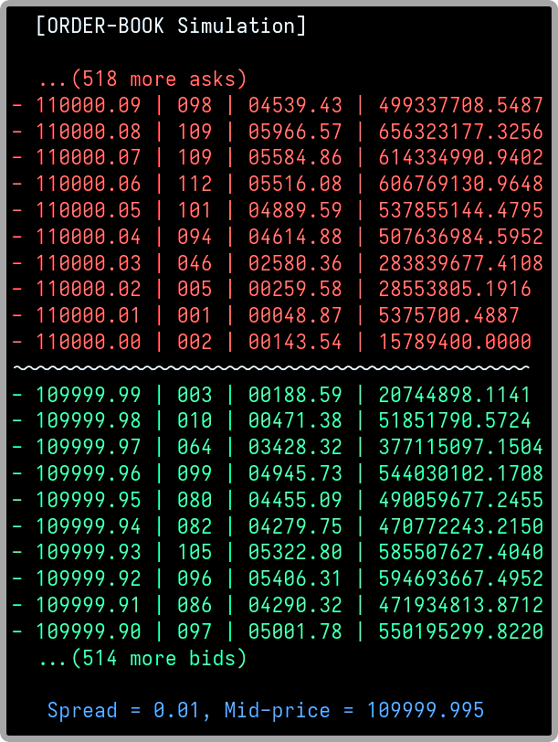

# `pylob` | Python Limit-Order-Book
Fast &amp; minimalist limit-order-book (LOB) implementation in pure Python.

*Package currently in development, not usable yet.*

**TODO**:
- [x] `uuid` is slow, find a better alternative
- [ ] implement the three types of orders
- [ ] write proper benchmarks that will be used to guide development
- [ ] profiling

The goal is to build an efficient, clean and easy to use package for whoever needs to be able to quickly run a limit order-book in their Python project. We aim to keep the API minimalist and simple, while having reasonable performances (for a pure Python implementation). We intend the final project to not exceed 1000 lines of code. 

We implement three types of orders: FOK, GTC and GTD. Every order is defined as a limit order, but will be executed as market order if its price matches the best bid or ask limit in the book.  

*NOTE: LLMs are used for writing some tests.*
